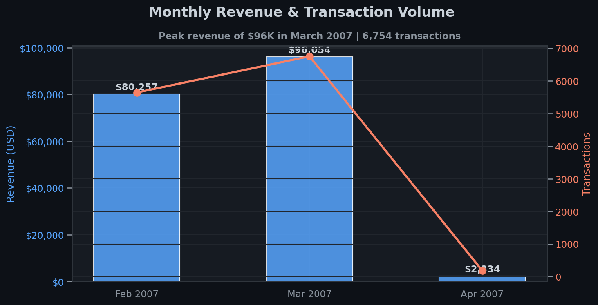
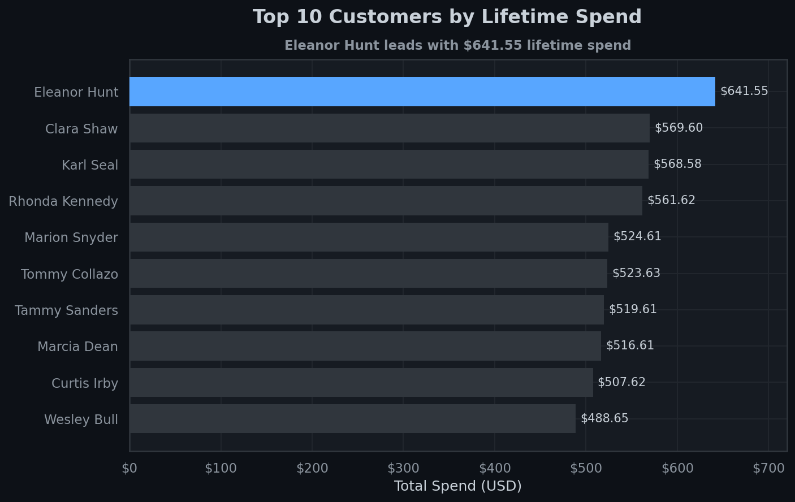
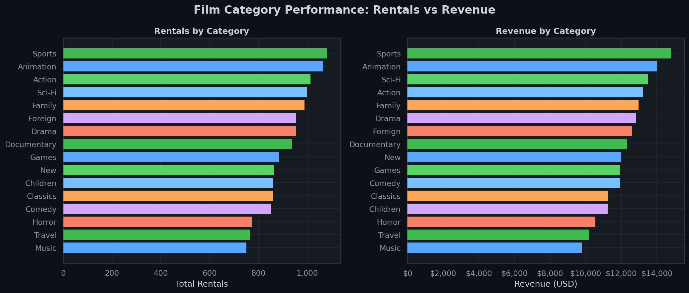
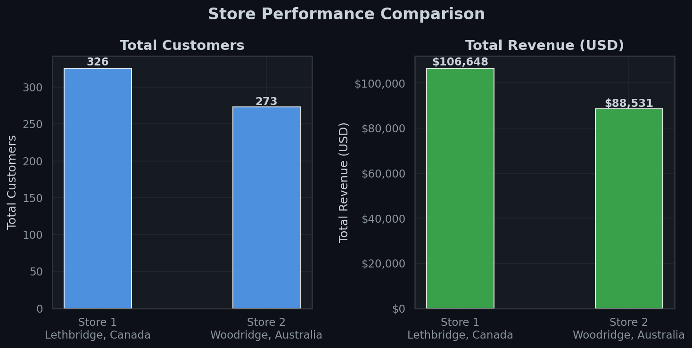
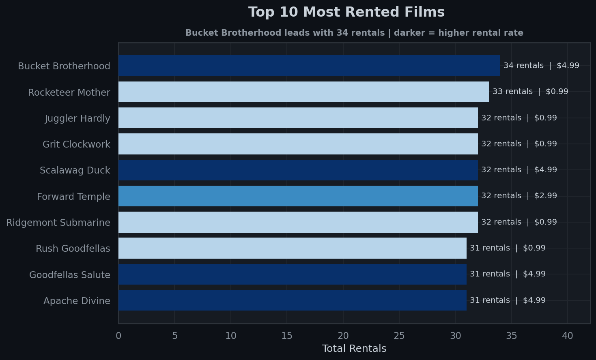

# 🎬 Laron Rental — Business Analysis


> **An end-to-end business intelligence analysis of a DVD rental company using real relational data (Sakila DB), covering revenue trends, customer behaviour, film performance, and store comparisons.**

---

## 📊 Key Business Insights

| Metric | Value |
|--------|-------|
| 💰 Peak Monthly Revenue | **$96,053** (March 2007) |
| 🏆 Top Customer Lifetime Value | **$641.55** — Eleanor Hunt |
| 🎭 Most Rented Category | **Sports** — 1,081 rentals |
| 🎬 Most Rented Film | **Bucket Brotherhood** — 34 rentals |
| 🏪 Store 1 Revenue (Canada) | **$106,647** |
| 🏪 Store 2 Revenue (Australia) | **$88,530** |
| 👥 Total Active Customers | **599** across 2 stores |

---

## 📈 Visualisations

### 1. Monthly Revenue & Transaction Volume


> Revenue peaked at **$96K in March 2007** with 6,754 transactions before a sharp decline in April — likely a seasonal or catalogue-driven pattern.

---

### 2. Top 10 Customers by Lifetime Spend


> The top 10 customers each spent **$488–$641** over their lifetime. High-value customers like Eleanor Hunt and Clara Shaw are strong candidates for a loyalty programme.

---

### 3. Film Category Performance


> **Sports, Animation, and Action** dominate both rentals and revenue. Music and Travel lag behind — candidates for catalogue review or pricing adjustments.

---

### 4. Store Performance Comparison


> Store 1 (Canada) outperforms Store 2 (Australia) by **19.3% in revenue** and serves **19.4% more customers** — worth investigating for operational best practices.

---

### 5. Top 10 Most Rented Films


> **Bucket Brotherhood** leads with 34 rentals at a $4.99 rate — the highest revenue-per-rental among top titles. Low-rate films dominate volume, suggesting a freemium pricing opportunity.

---

## 🗂️ Project Structure

```
laron-rental-analysis/
│
├── scripts/
│   └── analysis.py          # Full analysis & visualisation script
│
├── visuals/
│   ├── 01_monthly_revenue.png
│   ├── 02_top_customers.png
│   ├── 03_category_performance.png
│   ├── 04_store_comparison.png
│   └── 05_top_films.png
│
├── data/                    # Raw exported CSVs
│   ├── customer.csv
│   ├── payment.csv
│   └── rental.csv
│
└── README.md
```

---

## 🛠️ Tech Stack

- **Database**: PostgreSQL (Sakila sample database)
- **Language**: Python 3.10+
- **Libraries**: `pandas`, `matplotlib`, `seaborn`, `numpy`
- **Visualisation Theme**: Custom dark theme inspired by GitHub's colour palette

---

## 🚀 How to Run

```bash
# 1. Clone the repo
git clone https://github.com/Abdulrazaq282/Abdulrazaq-s-Portfollio.git
cd Abdulrazaq-s-Portfollio/laron-rental-analysis

# 2. Install dependencies
pip install pandas matplotlib seaborn numpy

# 3. Run the analysis
python scripts/analysis.py
```

> **Note:** The script uses pre-loaded data. To connect to a live PostgreSQL instance, update the connection string in `scripts/analysis.py`.

---

## 💡 Business Recommendations

1. **Launch a loyalty programme** targeting top 50 customers — they represent a disproportionate share of revenue.
2. **Investigate Store 1's success** and replicate operational practices at Store 2.
3. **Reprice or promote** low-performing categories (Music, Travel) with targeted discounts.
4. **Stock more copies** of high-demand titles like Bucket Brotherhood and Rocketeer Mother to reduce stockout losses.
5. **Analyse the April drop** — understanding what caused the 97% transaction decline could prevent future revenue cliffs.

---

## 👤 Author

**Abdulrazaq SHOLA**  
📧 abdulrazaqodeyemi56@gmail.com  
🔗 [GitHub](https://github.com/Abdulrazaq282)

---

*Built with real data. Designed to inform decisions.*
