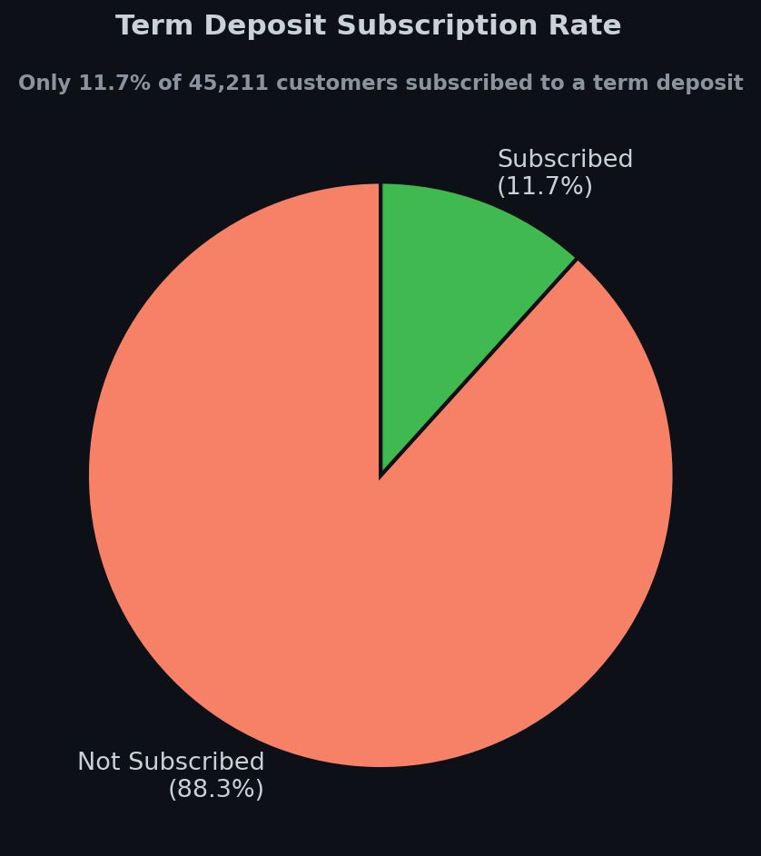
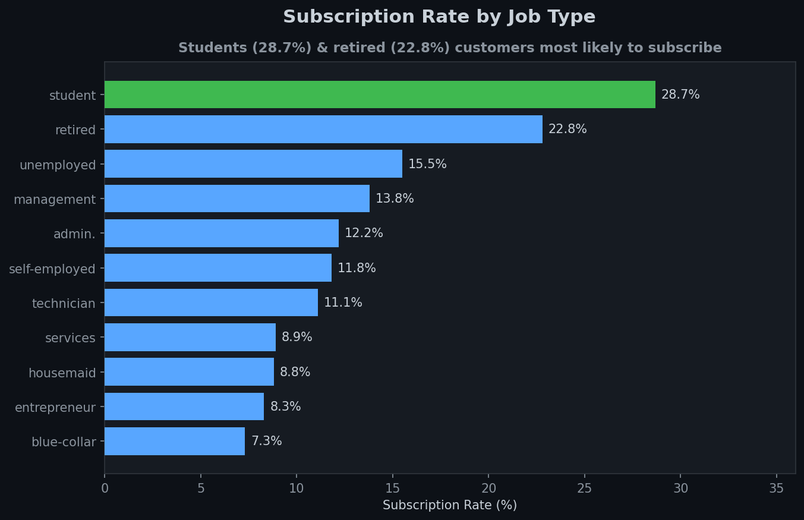
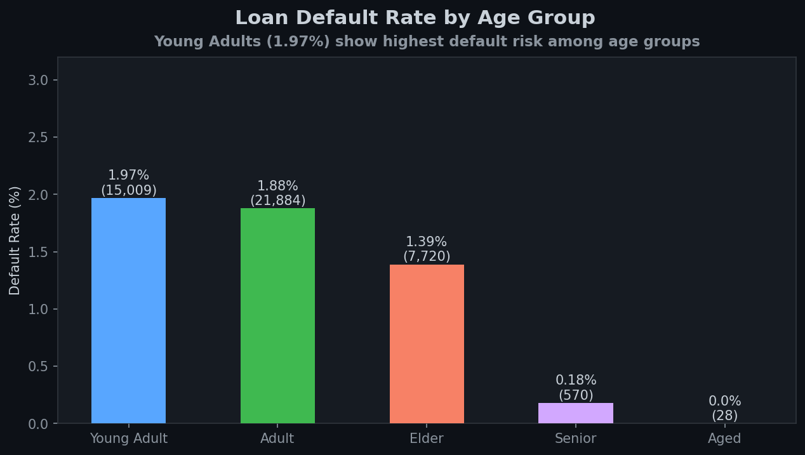
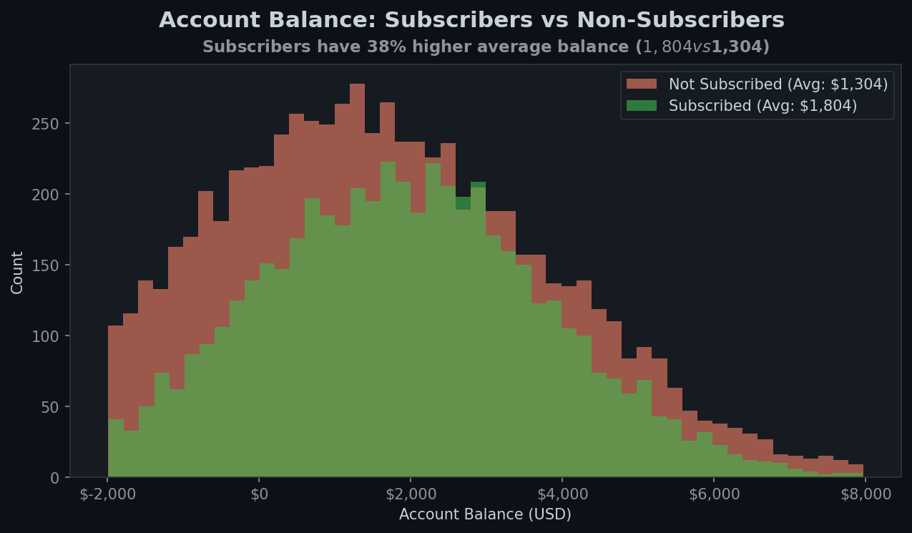
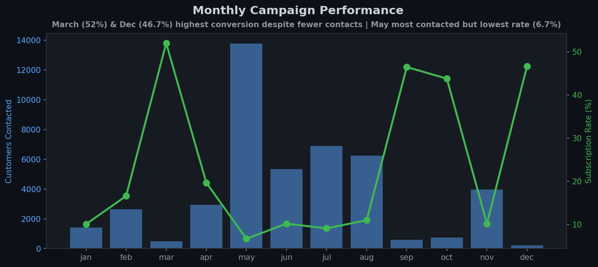
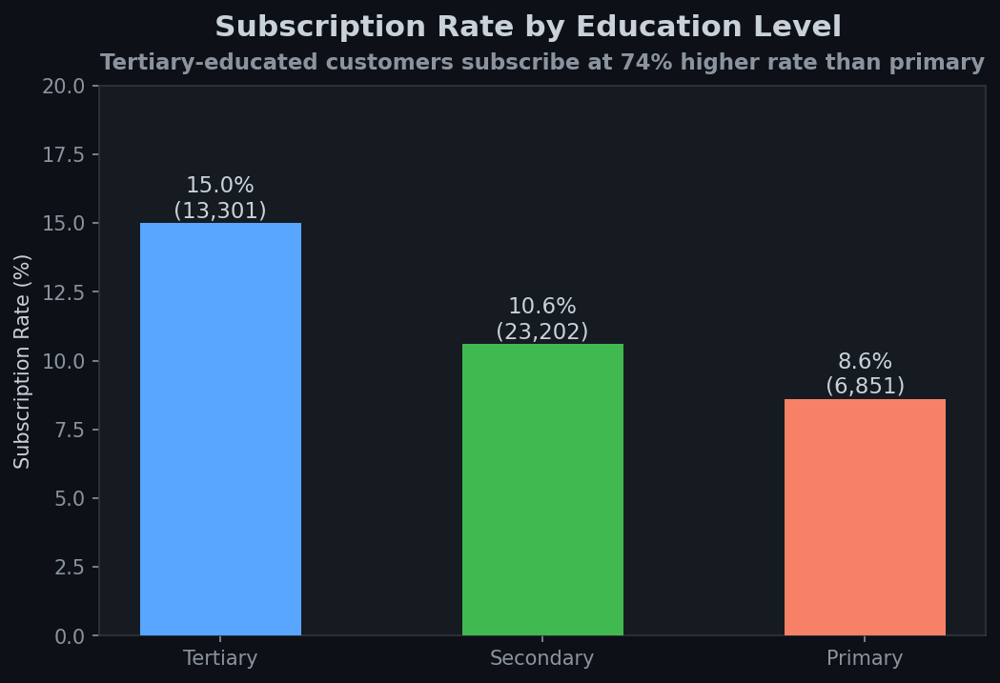

# 🏦 Microfinance Loan & Bank Marketing Analysis


> **An end-to-end analysis of 45,000+ bank customers covering loan default behaviour, term deposit subscription patterns, demographic segmentation, and marketing campaign effectiveness.**

---

## 📊 Key Business Insights

| Metric | Value |
|--------|-------|
| 👥 Total Customers Analysed | **45,211** |
| 📈 Subscription Rate | **11.7%** — only 5,289 subscribed |
| ⚠️ Highest Default Risk | **Young Adults** — 1.97% default rate |
| 🏆 Most Likely to Subscribe | **Students (28.7%)** & **Retired (22.8%)** |
| 💰 Subscriber Avg Balance | **$1,804** vs $1,304 for non-subscribers |
| 📅 Best Campaign Month | **March — 52% conversion rate** |
| 🎓 Education Impact | Tertiary-educated subscribe at **74% higher rate** |

---

## 📈 Visualisations

### 1. Term Deposit Subscription Rate


> Only **11.7%** of customers subscribed. This highlights a significant opportunity to improve targeting strategies and reduce wasted outreach.

---

### 2. Subscription Rate by Job Type


> **Students (28.7%)** and **retired customers (22.8%)** are the most receptive segments. Blue-collar workers (7.3%) are the hardest to convert — campaigns should be tailored differently for these groups.

---

### 3. Loan Default Rate by Age Group


> **Young Adults (1.97%)** and **Adults (1.88%)** carry the highest default risk. Lenders should apply stricter credit checks for these demographics while offering favourable terms to Senior and Elder customers.

---

### 4. Account Balance: Subscribers vs Non-Subscribers


> Customers who subscribe hold **38% higher average balances** ($1,804 vs $1,304). High-balance customers are significantly more likely to commit to long-term financial products.

---

### 5. Monthly Campaign Performance


> **March (52%)**, **October (43.8%)**, and **December (46.7%)** yield the highest conversion rates despite lower contact volumes. **May** had the most contacts (13,766) but the lowest conversion (6.7%) — suggesting volume alone doesn't drive results.

---

### 6. Subscription Rate by Education Level


> Tertiary-educated customers subscribe at **15%** vs just **8.6%** for primary-educated. Education level is a strong predictor of financial product uptake.

---

## 🗂️ Project Structure

```
microfinance-loan-analysis/
│
├── scripts/
│   └── analysis.py          # Full analysis & visualisation script
│
├── visuals/
│   ├── 01_subscription_rate.png
│   ├── 02_subscription_by_job.png
│   ├── 03_default_by_age_group.png
│   ├── 04_balance_by_subscription.png
│   ├── 05_campaign_by_month.png
│   └── 06_subscription_by_education.png
│
├── data/
│   └── loan_data.xlsx        # Source data (45,211 records)
│
└── README.md
```

---

## 🛠️ Tech Stack

- **Language:** Python 3.10+
- **Libraries:** `pandas`, `matplotlib`, `numpy`
- **Data Source:** Bank marketing dataset (Excel)
- **Visualisation Theme:** Custom dark theme

---

## 🚀 How to Run

```bash
# 1. Clone the repo
git clone https://github.com/Abdulrazaq282/Abdulrazaq-s-Portfollio.git
cd Abdulrazaq-s-Portfollio/microfinance-loan-analysis

# 2. Install dependencies
pip install pandas matplotlib numpy openpyxl

# 3. Run the analysis
python scripts/analysis.py
```

---

## 💡 Business Recommendations

1. **Target students and retirees** — their 28–29% conversion rate makes them 3x more valuable than blue-collar outreach.
2. **Shift campaign budget to March, October, and December** — conversion rates above 43% vs 6.7% in May.
3. **Prioritise high-balance customers** — subscribers average 38% more in their accounts; use balance as a key targeting filter.
4. **Tighten credit risk controls for Young Adults** — they carry the highest default rate (1.97%) and represent the largest customer segment.
5. **Invest in tertiary-educated segments** — they are 74% more likely to subscribe than primary-educated customers.

---

## 👤 Author

**Abdulrazaq SHOLA**  
📧 abdulrazaqodeyemi56@gmail.com  
🔗 [GitHub](https://github.com/Abdulrazaq282) · [LinkedIn](https://www.linkedin.com/in/odeyemi-abdul/)

---

*Built with real data. Designed to inform decisions.*
